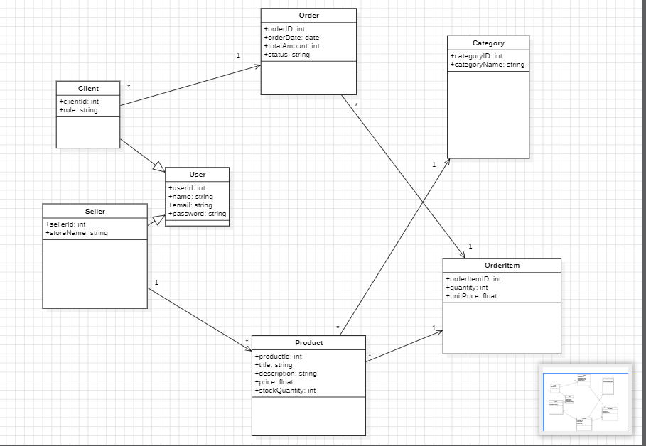
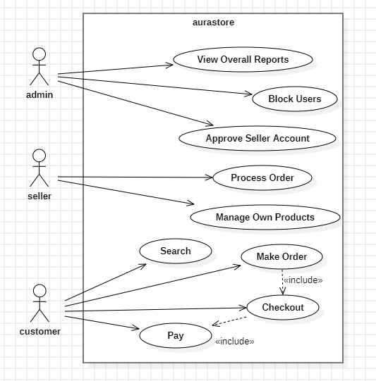
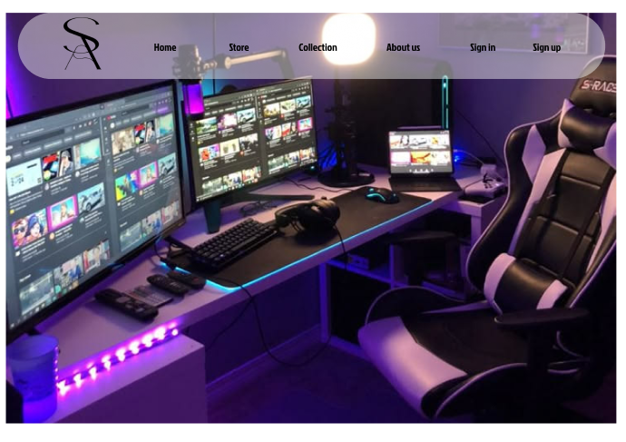

# Aurastore — Gaming E-Commerce Platform
## System Architecture & Class Diagram




[](https://www.figma.com/design/omLDZCBqjh3GUBFBPbY58c/home-dec?node-id=0-1&t=vrvuJUikLa9dXcDE-1)

[View Figma Workspace](https://www.figma.com/design/omLDZCBqjh3GUBFBPbY58c/home-dec?node-id=0-1&t=vrvuJUikLa9dXcDE-1)


English

-Project Overview
Aurastore is an online e-commerce platform dedicated to high-performance gaming hardware, peripherals, and minimalist tech setups.

This project represents a complete rewrite and rebuild of an earlier prototype. The core objective of this rebuild is to adopt professional developer standards, strictly enforce clean code principles, and establish a modular, scalable project structure.

-The Problem & Solution
The Problem: Modern tech buyers and gamers often struggle with cluttered, poorly organized e-commerce interfaces that obscure product specifications, lack modular architecture, and deliver slow user experiences.

The Solution: Aurastore solves this by introducing a Dark-Mode / Minimalist Luxury aesthetic that focuses on clarity, rapid navigation, and reusable component architectures (such as dynamic JavaScript-driven navigation and modular UI styling).

-Tech Stack
HTML5: Semantic structural markup.

CSS3: Custom modular styling, dark-mode gaming aesthetics, and responsive layout systems.

JavaScript (ES6+): Component-based architecture (e.g., dynamic Navbar injection without external framework overhead), state management, and interactive UI features.

Java: Backend processing and business logic integration (planned/in development).

SQL: Relational database architecture, data modeling, and distributed query optimization (fragmentation).

-Incremental Versioning & Workflow
This repository follows an iterative development workflow. Incremental versions and feature updates are regularly committed to GitHub to track continuous improvements, code refactoring, and stability enhancements over time.


   -----------------------------


Español

-Descripción del Proyecto
Aurastore es una plataforma de comercio electrónico orientada a periféricos gaming de alto rendimiento y componentes informáticos con una estética cuidada.

Este proyecto supone una reestructuración y reescritura completa de un prototipo anterior. El objetivo principal de esta nueva versión es implementar estándares profesionales de desarrollo, aplicar principios de código limpio (clean code) y estructurar el proyecto de forma modular y escalable.

-Problema y Solución
El Problema: Muchas tiendas online de tecnología sufren de interfaces sobrecargadas, desorganizadas y con una navegación lenta que dificulta la localización de especificaciones y productos.

La Solución: Aurastore resuelve esto mediante una interfaz basada en un diseño Dark-Mode / Minimalist Luxury, enfocado en la claridad, una navegación rápida y el uso de componentes reutilizables (como un Navbar dinámico inyectado con JavaScript).

-Tecnologías Utilizadas
HTML5: Marcado semántico estructurado.

CSS3: Estilos modulares personalizados, estética gaming oscura y diseño adaptativo (responsive).

JavaScript (ES6+): Arquitectura basada en componentes reutilizables (inyección dinámica de Navbar sin necesidad de frameworks pesados) e interactividad.

Java: Procesamiento backend y lógica de negocio (en desarrollo/planificado).

SQL: Diseño de bases de datos relacionales, modelado de datos y optimización mediante fragmentación.

-Control de Versiones e Integración Continua
Este repositorio sigue un flujo de trabajo iterativo. Se publicarán versiones de forma periódica en GitHub para registrar el progreso, la refactorización del código y la evolución continua del sistema.


### Project Directory Structure / Estructura del Proyecto


```text
aurastore/
├── index.html          # Home Page / Página Principal
├── store.html          # Catalog Page / Catálogo de Productos
├── collection.html     # Featured Collections / Colecciones
├── about.html          # About Us / Sobre Nosotros
├── README.md           # Project Documentation / Documentación
├── css/                # Modular Stylesheets / Hojas de Estilo
│   ├── style.css       # Global Styles / Estilos Globales
│   └── navbar.css      # Navigation Styling / Estilos de Navegación
├── js/                 # Client-Side Logic / Lógica JavaScript
│   ├── components.js   # Reusable UI Components (Navbar)
│   └── main.js         # General Interactivity
└── docs-design/        # Architecture & Design Assets
    ├── database/       # SQL Schemas & Queries
    ├── figma/          # Design Mockups / Prototipos
    └── uml/            # UML Diagrams (Class & Use Case)
```